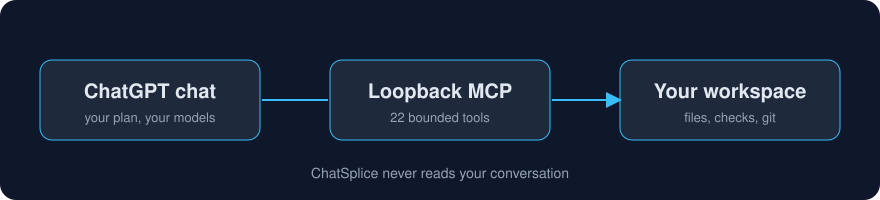

<p align="center">
  
</p>

<h1 align="center">ChatSplice</h1>
<p align="center"><strong>Chat with ChatGPT. Work on your local project.</strong></p>

ChatSplice brings ChatGPT, a file editor, and a terminal into one macOS app. Ask ChatGPT to read or change your project files, then review the result in the same window.

Use your own ChatGPT account. MCP connects the conversation to local tools, without a second AI model or a separate model API key.

[한국어](docs/ko/README.ko.md) · [Setup guide](docs/getting-started.md) · [Security](docs/security.md)


_A preview of the app with fictional projects and example output. No real conversations, account details, or credentials are shown._

> ChatSplice is an independent project, not an official OpenAI app. It is currently a pre-release for macOS 13+ on Apple Silicon.

## What you can do

- Ask ChatGPT to read and edit files, run supported project checks, and use supported Git commands.
- Keep each local folder linked to its own ChatGPT Project and instructions.
- Open files in editor tabs and review or edit changes yourself.
- Use the integrated terminal for your own commands. ChatGPT cannot read or operate this terminal.

ChatGPT tool access depends on your account and workspace. Before setting up ChatSplice, check that you can use **Developer mode** and **Secure MCP Tunnel**; a ChatGPT subscription alone does not guarantee access.

## Get started

### 1. Open ChatSplice

Download an Apple Silicon DMG from [Releases](https://github.com/dev-restart/ChatSplice/releases), when available, and copy the app to Applications. The first build appears after a successful release workflow. Current builds are unsigned; see the [installation guide](docs/release-distribution.md) for file verification and macOS security prompts.

<details>
<summary>Run from source instead</summary>

Use Node.js 22.19+ and pnpm 10.33.2. In the source folder, run:

```bash
nvm use # If you use nvm
pnpm install --frozen-lockfile
pnpm dev
```

`pnpm dev` builds and opens the app. Use `pnpm start` to reopen an unchanged build. `pnpm build` only builds; it does not start the app or connection.

</details>

### 2. Connect your ChatGPT account

This is a one-time setup for your account and workspace:

1. In ChatGPT, enable **Settings → Security and login → Developer mode**. Your workspace may require admin approval.
2. In [OpenAI Platform → Tunnels](https://platform.openai.com/settings/organization/tunnels), create a Tunnel and associate it with both your Platform organization and ChatGPT workspace. Open ChatSplice's **Connection management**, save the Tunnel ID and Organization ID, and register the runtime key in the secure prompt.
3. In [ChatGPT → Plugins](https://chatgpt.com/plugins), create an MCP app, choose **Connection → Tunnel**, select your Tunnel, and scan its tools. Name it **ChatSplice MCP**, or enter your chosen name in ChatSplice's connection settings.

ChatSplice installs the official macOS Tunnel client if it is missing. Save the settings and key, then enable **Start tunnel when the app starts** to reconnect on launch. The first-time OpenAI setup above is still required.

For permissions, connection checks, and troubleshooting, follow the [setup guide](docs/getting-started.md#connect-chatgpt-developer-mode).

<details>
<summary>Preview the connection settings</summary>


The app-name setting tells ChatSplice which MCP app to select. It does not rename the app in ChatGPT.

</details>

### 3. Work on a project

Add a local folder from the sidebar and use project setup to create its ChatGPT Project. To connect an existing Project, or if automatic setup is unavailable, copy the instructions from the app into **Project settings → Project instructions** and save.

For each message that needs local tools, select **ChatSplice MCP** in the ChatGPT composer and check that its app label is visible. Then make a specific request, for example:

```text
Change the button text in src/WelcomeCard.tsx to "Get started", then run the existing tests.
```

Review the changed file and the test result. Registering a folder does not grant ChatGPT extra tool permissions.

## Keep project instructions simple

ChatSplice creates short Project instructions for the local folder and its tools. Supported screens refresh automatically while preserving your own text; otherwise, copy and save the instructions manually. Start a new Project chat after an update.

Keep detailed development rules in your project's `AGENTS.md`, and design rules in `docs/design-guidelines.md` if needed. The generated instructions tell ChatGPT to read them at the start of a task, so you do not need to paste a long specification into every chat.

## Settings and privacy

No `.env` file is needed. Enter settings and the Tunnel key in **Connection management**. Settings stay local; the key is encrypted with protection from macOS Keychain.

Files read through MCP are sent to ChatGPT to handle your request. ChatSplice does not collect conversation history or cookies, or send messages automatically. Local tools restrict paths and commands; the manual terminal uses your normal user permissions. Read the [security guide](docs/security.md) before connecting sensitive projects.

Save editor changes before quitting: unsaved drafts are not restored after a restart. Connection keys, private project bindings, and real conversations should stay out of public repositories and bug reports.

## Releases and updates

Pushing to `main` runs checks. A matching `v*` version tag publishes a GitHub Release after successful checks and packaging.

Current unsigned builds use manual updates: choose **ChatSplice → 업데이트 확인…** (Check for Updates), download the new release, and replace the app. Automatic updates require a signed build, Apple credentials, and verification. The code is prepared; see [release setup](docs/release-distribution.md) to enable it.

Local execution through the Tunnel has been verified on one ChatGPT account. Broader account tests, hosted CI, fresh installs, upgrades, and signed updates remain on the [release checklist](RELEASE_CHECKLIST.md).

Source publication does not list an app in ChatGPT's public directory. Tunnels are private developer connections; public apps follow a separate [OpenAI submission process](https://developers.openai.com/api/docs/guides/secure-mcp-tunnels). Account permissions, usage limits, and service terms still apply.

## Contributing

Read [CONTRIBUTING.md](CONTRIBUTING.md) and the [Code of Conduct](CODE_OF_CONDUCT.md). Developers can find the supported operations in [MCP tools](docs/mcp-tools.md) and the [current contract](docs/current-contract.md). Report security issues through [SECURITY.md](SECURITY.md).

Released under the [MIT license](LICENSE). See [third-party notices](THIRD_PARTY_NOTICES.md) for bundled dependencies. ChatGPT and Codex are OpenAI trademarks.
