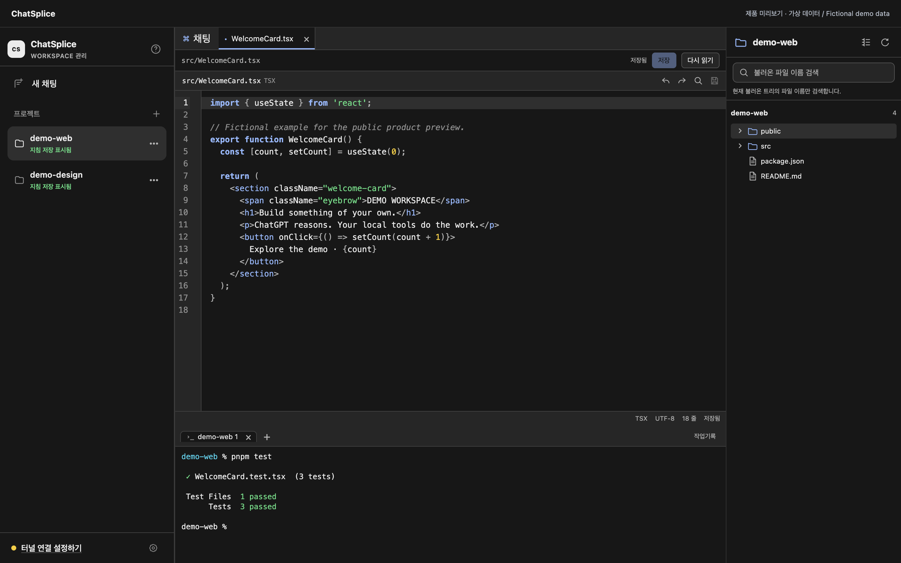
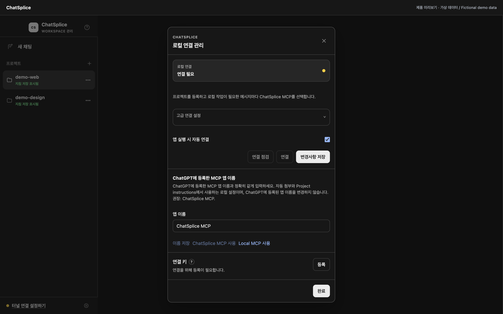

# ChatSplice

**ChatGPT와 대화하며 내 컴퓨터의 프로젝트를 수정하세요.**

ChatSplice는 ChatGPT, 파일 에디터, 터미널을 한 창에서 사용하는 macOS 앱입니다. ChatGPT에 프로젝트 파일을 읽거나 수정해 달라고 요청하고, 같은 창에서 결과를 확인할 수 있습니다.

기존 ChatGPT 계정으로 사용합니다. MCP가 대화와 로컬 작업 도구를 연결하므로, 별도 AI 모델이나 모델용 API key는 필요하지 않습니다.

[English](../../README.md) · [설치·설정 안내](../getting-started.md) · [터널 연결 안내](../onboarding.md) · [보안 안내](../security.md)



_ChatSplice에서는 프로젝트를 관리하고, 폴더와 파일을 살펴보며, 터미널을 한 창에서 사용할 수 있습니다._

> ChatSplice는 OpenAI 공식 앱이 아닌 독립 프로젝트입니다. 현재 macOS 13 이상, Apple Silicon용 사전 공개 버전입니다.

## 무엇을 할 수 있나요?

- ChatGPT에 파일 읽기·수정, 지원하는 프로젝트 검사와 Git 작업을 요청합니다.
- 로컬 폴더마다 ChatGPT 프로젝트와 지침을 연결해 관리합니다.
- 파일을 에디터 탭으로 열어 변경 내용을 확인하고 직접 수정합니다.
- 내 명령은 내장 터미널에서 실행합니다. ChatGPT는 이 터미널을 읽거나 조작할 수 없습니다.

ChatGPT의 도구 사용 권한은 계정과 워크스페이스에 따라 다릅니다. 먼저 **Developer mode**와 **Secure MCP Tunnel**을 사용할 수 있는지 확인하세요. ChatGPT 구독만으로 사용이 보장되지는 않습니다.

## 시작하기

### 1. 앱 실행

설치 파일이 게시되면 [Releases](https://github.com/dev-restart/ChatSplice/releases)에서 Apple Silicon용 DMG를 받아 Applications로 복사합니다. 첫 빌드는 릴리즈 작업이 성공한 뒤 제공됩니다. 현재 빌드는 서명되지 않았으므로 파일 검증과 macOS 보안 알림은 [설치 안내](../release-distribution.md)를 확인하세요.

<details>
<summary>소스로 직접 실행하려면</summary>

Node.js 22.19 이상과 pnpm 10.33.2를 준비하고, 소스 폴더에서 실행합니다.

```bash
nvm use # nvm을 사용하는 경우
pnpm install --frozen-lockfile
pnpm dev
```

`pnpm dev`는 빌드한 뒤 앱을 엽니다. 소스를 바꾸지 않았다면 `pnpm start`로 다시 실행합니다. `pnpm build`는 빌드만 하며 앱이나 터널 연결을 시작하지 않습니다.

</details>

### 2. ChatGPT 계정 연결

계정과 워크스페이스별로 처음 한 번 설정합니다.

1. ChatGPT의 **Settings → Security and login → Developer mode**를 켭니다. 워크스페이스에 따라 관리자 승인이 필요할 수 있습니다.
2. [OpenAI Platform → Tunnels](https://platform.openai.com/settings/organization/tunnels)에서 Tunnel을 만들고, Platform 조직과 ChatGPT 워크스페이스를 모두 연결합니다. ChatSplice의 **연결 관리**에서 Tunnel ID와 Organization ID를 저장하고, 보안 입력 창에서 runtime key를 등록합니다.
3. [ChatGPT → Plugins](https://chatgpt.com/plugins)에서 MCP 앱을 만들고 **Connection → Tunnel**을 선택해 도구를 검색합니다. 앱 이름은 **ChatSplice MCP**를 권장합니다. 다른 이름을 사용했다면 ChatSplice 연결 설정에도 같은 이름을 입력합니다.

macOS Tunnel client가 없으면 자동 설치합니다. 설정과 키를 저장하고 **앱 실행 시 자동 연결**을 켜 두면 다음부터 앱을 열 때 연결합니다. 위의 OpenAI 최초 설정은 직접 해야 합니다.

필요한 권한, 연결 점검, 오류 해결은 [터널 연결 안내](../onboarding.md)와 [상세 설정 안내](../getting-started.md#connect-chatgpt-developer-mode)를 참고하세요.

<details>
<summary>연결 설정 화면 미리보기</summary>



앱 이름 설정은 ChatSplice가 선택할 MCP 앱을 알려 주는 값입니다. 여기서 저장해도 ChatGPT에 등록된 앱 이름은 바뀌지 않습니다.

</details>

### 3. 프로젝트에서 작업

사이드바에서 로컬 폴더를 등록하고 프로젝트 설정 기능으로 ChatGPT 프로젝트를 만듭니다. 기존 프로젝트에 연결하거나 자동 설정이 지원되지 않으면, 앱의 지침을 **Project settings → Project instructions**에 복사해 저장합니다.

로컬 작업을 요청하는 메시지마다 ChatGPT 입력창에서 **ChatSplice MCP**를 선택하고, 선택한 앱 이름이 표시되는지 확인하세요. 요청은 파일과 원하는 결과를 구체적으로 적으면 됩니다.

```text
src/WelcomeCard.tsx의 버튼 문구를 "시작하기"로 바꾸고 기존 테스트를 실행해 주세요.
```

변경된 파일과 테스트 결과를 확인합니다. 폴더를 등록하는 것만으로 ChatGPT의 도구 권한이 늘어나지는 않습니다.

## 프로젝트 지침은 짧게 관리합니다

ChatSplice는 작업할 폴더와 도구 사용 방법을 짧은 프로젝트 지침으로 만듭니다. 지원하는 화면에서는 사용자의 지침을 보존하며 자동 갱신합니다. 자동 갱신이 어려우면 복사해 직접 저장하고, 변경 후에는 해당 프로젝트에서 새 대화를 시작하세요.

상세 개발 규칙은 프로젝트의 `AGENTS.md`에, 디자인 규칙은 필요하면 `docs/design-guidelines.md`에 둡니다. 자동 생성된 지침이 작업 시작 시 이 파일들을 읽도록 안내하므로 긴 명세를 매번 붙여 넣을 필요가 없습니다.

## 설정과 개인정보

`.env` 파일은 필요하지 않습니다. 설정과 Tunnel key는 **연결 관리**에서 입력합니다. 설정은 로컬에 보관하고, 키는 macOS Keychain의 보호 아래 암호화해 저장합니다.

MCP로 읽은 파일 내용은 요청 처리를 위해 ChatGPT에 전달됩니다. ChatSplice는 대화 기록이나 쿠키를 수집하거나 메시지를 자동 전송하지 않습니다. 도구는 파일 경로와 명령을 제한하며, 수동 터미널은 일반 사용자 권한으로 실행됩니다. 민감한 프로젝트를 연결하기 전에는 [보안 안내](../security.md)를 확인하세요.

저장하지 않은 에디터 내용은 재시작 후 복원되지 않으므로 종료 전에 저장하세요. 연결 키, 비공개 프로젝트 연결 정보, 실제 대화 내용은 공개 저장소나 오류 신고에 포함하지 마세요.

## 배포와 업데이트

`main`에 코드를 올리면 검증을 실행합니다. 앱 버전과 일치하는 `v*` 버전 태그를 올리면 검증과 패키징이 성공한 뒤 GitHub Release에 자동 게시합니다.

현재 서명되지 않은 앱은 **ChatSplice → 업데이트 확인…**에서 새 버전을 받아 직접 교체합니다. 자동 업데이트 코드는 준비되어 있지만, 서명된 빌드와 Apple 자격 증명, 실제 동작 검증이 필요합니다. 설정 방법은 [배포 안내](../release-distribution.md)에 있습니다.

ChatGPT 계정 하나에서 Tunnel을 통한 로컬 실행을 확인했습니다. 더 넓은 계정 검증, GitHub CI 실행, 새 설치, 업그레이드, 서명된 업데이트 확인은 [릴리즈 체크리스트](../../RELEASE_CHECKLIST.md)에 남아 있습니다.

소스 공개만으로 ChatGPT 공개 앱 목록에 등록되지는 않습니다. Tunnel은 비공개 개발 연결용이며, 공개 앱은 [OpenAI의 별도 등록 절차](https://developers.openai.com/api/docs/guides/secure-mcp-tunnels)를 따릅니다. 계정 권한, 사용량 제한, 서비스 약관은 그대로 적용됩니다.

## 기여와 라이선스

기여 전 [기여 안내](../../CONTRIBUTING.md)와 [행동 강령](../../CODE_OF_CONDUCT.md)을 읽어 주세요. 지원하는 도구와 내부 동작은 [MCP 도구](../mcp-tools.md), [현재 제품 계약](../current-contract.md)에 정리되어 있습니다. 보안 문제는 [보안 신고 안내](../../SECURITY.md)를 따릅니다.

[MIT 라이선스](../../LICENSE)로 공개합니다. 포함된 외부 라이브러리는 [라이선스 고지](../../THIRD_PARTY_NOTICES.md)를 참고하세요. ChatGPT와 Codex는 OpenAI의 상표입니다.
